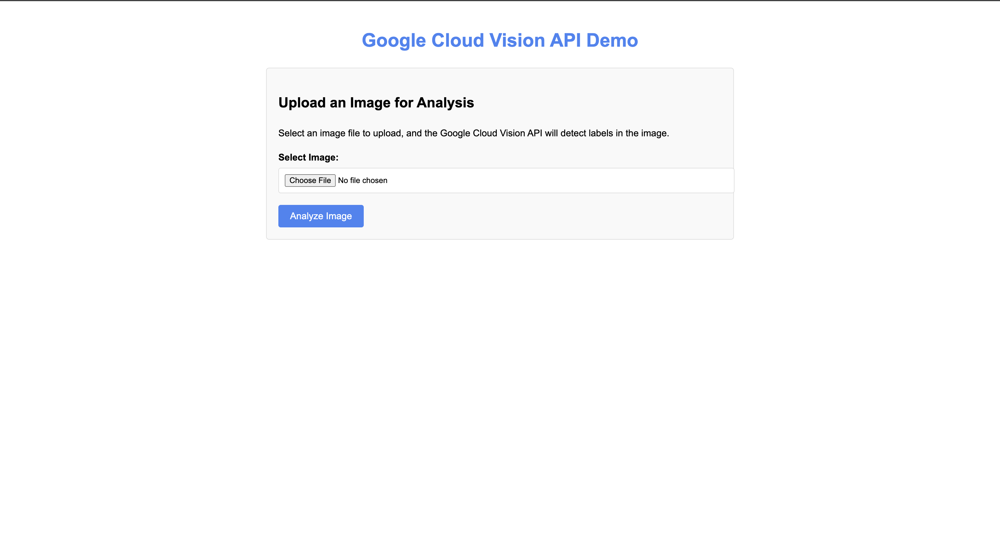
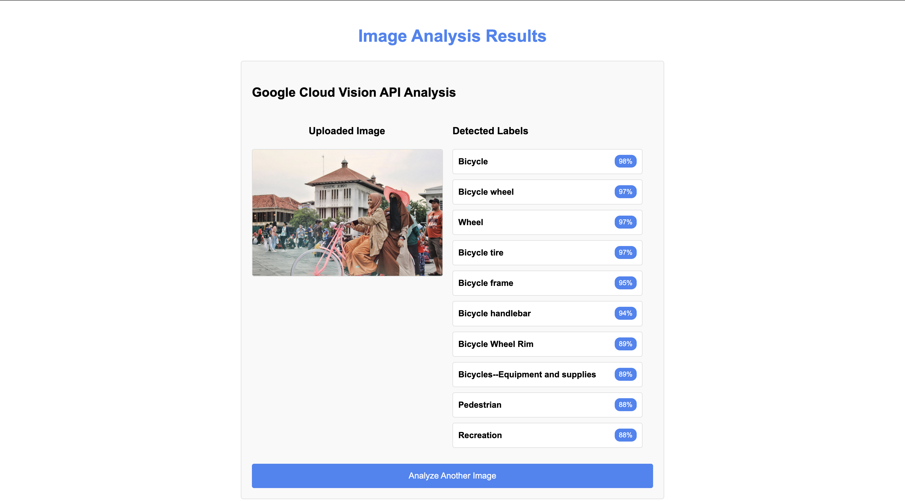

# Google Cloud Vision API Demo

This is a full-stack web application that demonstrates the use of Google Cloud Vision API to detect labels in uploaded images. The application is built with Node.js and Express, and can be deployed to Google App Engine.

## Features

- Upload images through a web interface
- Process images using Google Cloud Vision API
- Display detected labels with confidence scores
- Responsive design for mobile and desktop

## Prerequisites

- Node.js (v16 or later)
- npm or yarn
- Google Cloud Platform account
- Google Cloud Vision API enabled
- Google Cloud SDK (for deployment)

## Setup

### 1. Clone the repository

```bash
git clone <repository-url>
cd vision-app
```

### 2. Install dependencies

```bash
npm install
```

### 3. Set up Google Cloud Vision API credentials

1. Create a Google Cloud Platform project
2. Enable the Cloud Vision API
3. Create a service account and download the key file
4. Rename the key file to `key.json` and place it in the project root directory
   (or update the .env file with the correct path)

### 4. Configure environment variables

Create a `.env` file in the project root with the following content:

```
GOOGLE_APPLICATION_CREDENTIALS=./key.json
PORT=8080
```

## Running Locally

Start the development server:

```bash
npm run dev
```

## Project Structure

```
vision-app/
├── server.js           # Main Express server
├── package.json        # Project dependencies and scripts
├── app.yaml            # Google App Engine configuration
├── .env                # Environment variables (local development)
├── .gcloudignore       # Files to exclude from deployment
├── views/
│   └── result.ejs      # EJS template for results page
├── public/
│   └── index.html      # Main HTML page with upload form
└── uploads/            # Directory for storing uploaded images
```

## Screenshots

### Home Page


### Results Page


